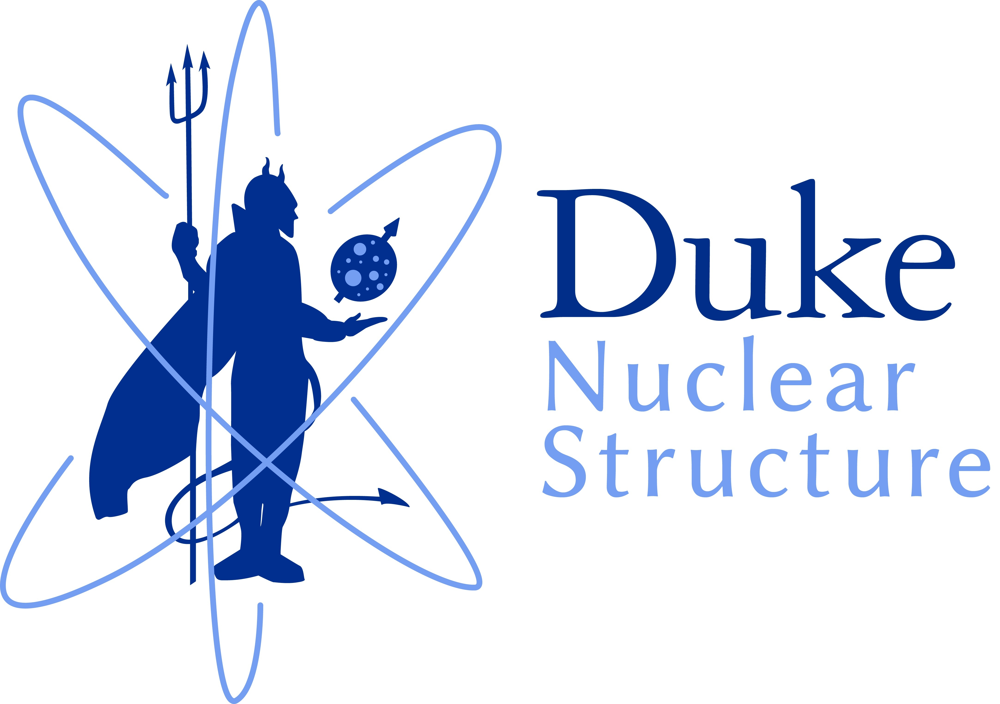

# CLAS12 Pipeline
This repository is a generalized analysis pipeline written for the analysis of lambda hyperons at CLAS12, but easily extendable to other channels.

## Design Philosophy
Use a **simple** and **consistent** naming scheme for output file structures.
**Always** save numeric values for histograms and results for easy replotting.
Track machine learning models using a database.

## Structure

The `bin` folder contains setup and environment scripts needed to build the repository and setup the environment.

The `driver` folder contains scripts to run functionalities from the following folders (in order).

* `analysis`
* `ml`
* `macros`
* `plot`

This reduces your analysis to a single push once you have written all the steps.

## Pre-requisites
Java
C++
CMake
ROOT
Python3

## Installation
TODO

#

Contact: matthew.mceneaney@duke.edu
